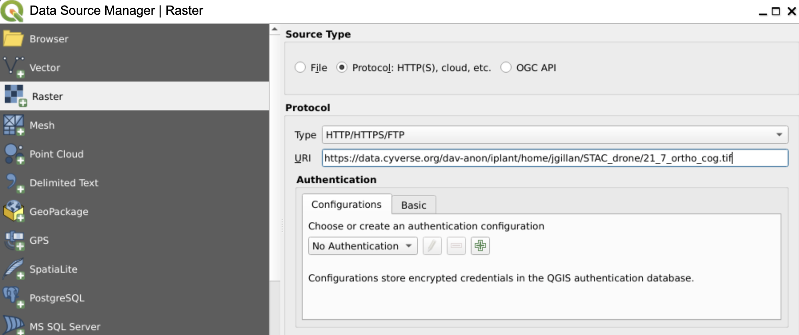
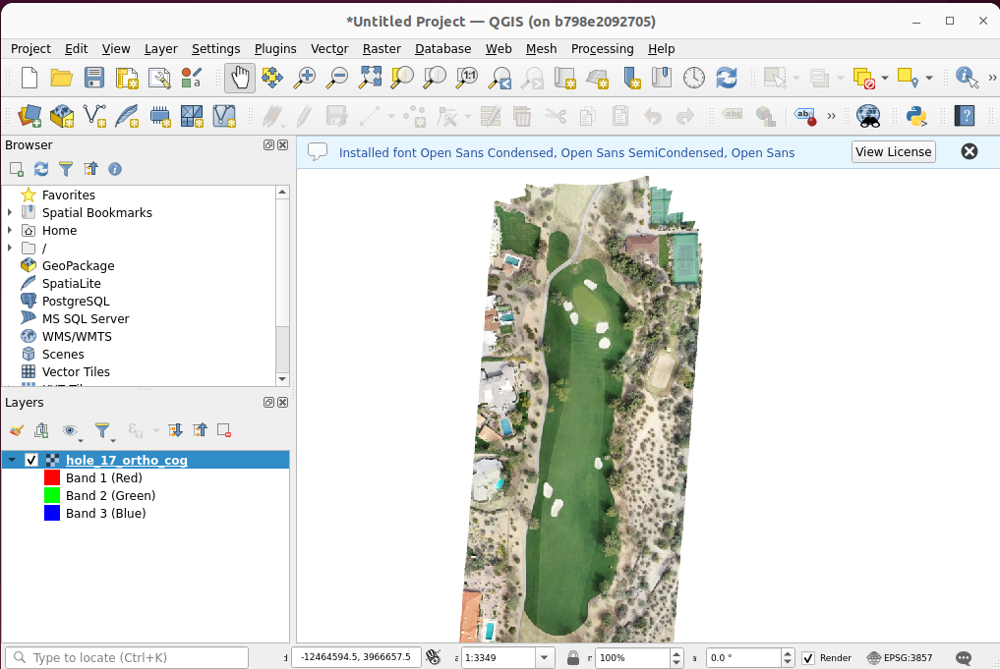
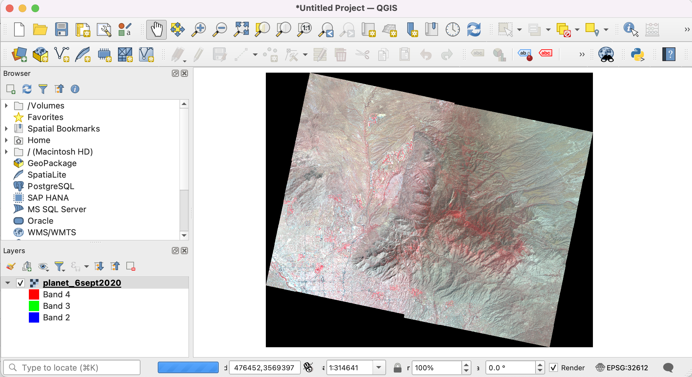

[Jump to :material-hand-clap: hands-on lesson :material-school: ](#hands-on)

<figure markdown>
  { width="200" }
  <figcaption> </figcaption>
</figure>

### Background

The [TIFF file format (Tagged Image File Format)](https://en.wikipedia.org/wiki/TIFF){target=_blank} is an old format dating back to 1992. TIFF are great for high-resolution verbatim [raster images](https://en.wikipedia.org/wiki/Raster_graphics){target=_blank}. TIFF are still used a bit in high-end photography, but where it has really grown a second life is in digital cartography. The variation called [GeoTIFF](https://en.wikipedia.org/wiki/GeoTIFF){target=_blank} has been widely adopted as a way to share satellite images and other satellite data.

While the GeoTIFF file format has long been thought of as only suitable for raw data: if you wanted to display it on a map, you’d convert it into tiles. If you wanted a static image, you’d render it into a PNG or JPEG. But ***Cloud-Optimized GeoTIFF*** means that GeoTIFFs can be a bit more accessible than they used to be. 

### Cloud Optimized GeoTIFF (COG)
A [Cloud Optimized GeoTIFF (COG)](https://www.cogeo.org/){target=_blank} is a regular [GeoTIFF file](https://www.ogc.org/standards/geotiff){target=_blank}, aimed at being hosted on a HTTP file server, with an internal organization that enables more efficient workflows on the cloud. In other words, we can stream the content of a GeoTIFF file from a server into a client application without having to download the full file.


COGs have three major features that are baked into the file: 

* [Internal tiling](#tiling)
* [Internal overview structures](#overviews)
* [HTTP GET Range Requests](#https-get-range-request)

### Tiling

Tiles are small, regular, and independent parts of a larger map. They are typically 256x256 pixels in size. COGs have tiles explicitly specified in their format structure, whereas regular GeoTIFFs may not. Tiling is a way to speed up map display because only the tiles that are visible in the current view need to be loaded.


### Overviews 

Overviews are downsampled thumbnail images of the tile. A COG will have many overviews matched to each [Zoom Level](https://wiki.openstreetmap.org/wiki/Zoom_levels){target=_blank}.

<figure markdown>
  <a href="https://github.com/tyson-swetnam/agic-2022/raw/main/assets/images/geotiff_pyramid.png" target="blank" rel="geotiff_pyramid">{ width="500" } </a>
    <figcaption>GeoTIFF pyramid by Zoom Level</figcaption>
</figure>

### HTTP(s) GET Range Request

The HTTP GET Range Request, also known as [Byte Serving](https://en.wikipedia.org/wiki/Byte_serving){target=_blank}, allows a client to request specific chunks of the COG using a combination of the tiles and overviews. If you are zoomed into a specific portion of the COG, then you only request the tiles that are visible in the current view. This is the same technology that enables streaming of other media types like video and audio. 


Check out the [COG Specification](https://github.com/cogeotiff/cog-spec/blob/master/spec.md){target=_blank}
___

### Example COGs on the internet
There are numerous cloud based data stores hosting COGs, take a look through a few of these:


* [Microsoft Planetary Computer Catalog](https://planetarycomputer.microsoft.com/catalog){target=_blank} - most of the imagery datasets in Planetary Computer are hosted as COGs. You can also view the catalog through the Planetary Computer [STAC API browser](https://radiantearth.github.io/stac-browser/#/external/planetarycomputer.microsoft.com/api/stac/v1/){target=_blank} 

* [ESA Sentinel-2 COGs](https://registry.opendata.aws/sentinel-2-l2a-cogs/){target=_blank}


* [Planet](https://www.planet.com/) is streaming out their imagery as COGs. You can also do simple analysis of COGs directly within the Planet platform. 

* This [example COG](https://www.cogeo.org/map/#/url/https%3A%2F%2Fdata.cyverse.org%2Fdav-anon%2Fiplant%2Fhome%2Fjgillan%2FSTAC_drone%2F22_2_ortho_cog.tif/center/-110.84602,31.78408/zoom/18){target=_blank} is a drone orthomosaic that is hosted in Cyverse Data Store. We can stream it to the [CogEO Viewer](https://www.cogeo.org/map/){target=_blank}. 

* Here is another [example](https://www.cogeo.org/map/#/url/https%3A%2F%2Foin-hotosm.s3.us-east-1.amazonaws.com%2F64d1bd4419cb3a000147a56a%2F0%2F64d1bd4419cb3a000147a56b.tif/center/-90.68608,42.49636/zoom/17){target=_blank} of drone imagery COG from [OpenAerialMap](https://openaerialmap.org/){target=_blank}. The data is hosted on AWS and streamed to the [CogEO Viewer](https://www.cogeo.org/map/){target=_blank}. 
___

### Applications that can use COGs

**COGs are geotiffs**, so any software application that can read and work with geotiffs will be able to read and work with COGs. This includes QGIS, ArcGIS, and Google Earth Engine.

* Stream COGs into QGIS see [Hands On Lesson](#hands-on)

* You can stream COGs into ArcGIS Pro following this [tutorial](https://opengislab.com/blog/2021/4/25/accessing-cloud-optimized-geotiffs-in-arcgis-pro){target=_blank}.


* You can [import](https://developers.google.com/earth-engine/guides/image_overview){target=_blank} and [export](https://developers.google.com/earth-engine/guides/exporting_images){target=_blank} Cloud Optimized Geotiffs in GEE

___

### Creating Your Own COGs

Creating COGs can be accomplished using:

* [GDAL](https://gdal.org){target=_blank} command line tool. See [Hands On Lesson](#create-cogs-with-gdal)

* [Cogger](https://github.com/airbusgeo/cogger){target=_blank} is a rapid COG generator from GeoTIFF

* In the python ecosystem [rio-cogeo](https://github.com/cogeotiff/rio-cogeo){target=_blank} is a RasterIO plugin to create and validate COGs 

___

## If I have COGs, do I still need a tile server? 
The breakthrough of COGs is that they have internal tiling which allows them to be streamed into applications without the need for an additional tile server. For most individuals and small organizations, this should be all you need. 

However, there are a few reasons why you might still want to use a tile server with COGs:

* Performance: Tile servers can cache tiles in memory, which can improve performance by reducing the number of times that tiles need to be read from disk.

* Scalability: Tile servers can be scaled to handle large numbers of requests.

* Security: Tile servers can be used to encrypt tiles, which can help to protect them from unauthorized access. If you are streaming COGs to a large number of clients or if you need to ensure that your tiles are secure, then I recommend using a tile server. However, if you are only streaming COGs to a small number of clients and you do not need to worry about security, then you can use the built-in tiles in COGs.

## How are COGs different from XYZ and WMTS tiles?

Web mapping tile services (WMTS) and XYZ tiles are primarily designed for efficient map display in web environments. Their main goal is to provide quick and seamless map visualizations over the internet by serving small, pre-defined tiles at multiple zoom levels. These tiles are ideal for web maps where users might pan and zoom around the globe, as the small tiles can be fetched and displayed rapidly.

However, for analysis purposes – where users might want to compute statistics, apply algorithms, or extract detailed information from imagery or raster data – these tiling methods are not optimal. The reason is that analysis often requires access to raw, high-resolution data rather than the downsampled or potentially lossy representations provided by these tiles.

That's where formats like Cloud Optimized GeoTIFFs (COGs) come into play. COGs are designed to allow for efficient access to high-resolution raster datasets, making them more suited for analytical purposes. With COGs, one can access and process only specific portions of a large raster without downloading the entire file, making it efficient for cloud-based analysis workflows.

**In summary, COGs are designed for efficient access to high-resolution raster data, while XYZ and WMTS tiles are designed for efficient map display.**

<br/>

___

# Hands On

## **Stream COGs into QGIS**

If you are unfamiliar with QGIS, here are 3 ways to use the open-source program

??? Info "Install on your local machine"

    [Download](https://www.qgis.org/en/site/forusers/download.html) and install QGIS on your local machine


??? Info "Use docker to run QGIS locally without installation"

    Educational material on software containers and Docker are [here](https://foss.cyverse.org/07_reproducibility_ii/){target=_blank}.

    ??? Info "Installing Docker on your personal computer"

        We are going to be using virtual machines on the cloud for this course, and we will explain why this is a good thing, but there may be a time when you want to run Docker on your own computer.

        Installing Docker takes a little time but it is reasonably straight forward and it is a one-time setup.

        Installation instructions from Docker Official Docs for common OS and chip architectures:

	      - [:fontawesome-brands-apple: Mac OS X](https://docs.docker.com/docker-for-mac/){target=_blank}
	      - [:fontawesome-brands-windows: Windows](https://docs.docker.com/docker-for-windows){target=_blank}
	      - [:fontawesome-brands-ubuntu: Ubuntu Linux](https://docs.docker.com/install/linux/docker-ce/ubuntu/){target=_blank}

    Once docker has been installed on your local machine it is easiest to use it on the Command Line Interace (CLI). Run the following commands in your terminal:

    this will allow the container access to the X server for display purposes
    
    `xhost +`  

    this will run the QGIS container and open the application

    ```
    docker run --rm -it --name qgis \
        -v /tmp/.X11-unix:/tmp/.X11-unix  \  
        -e DISPLAY=unix$DISPLAY \
        qgis/qgis:release-3_34 qgis
    ```    

??? Info "Run cloud instance of QGIS on Cyverse"

    [Cyverse](https://cyverse.org/){target=_blank} is a cloud computing and storage tool housed at the University of Arizona. You can sign up for a user account [here](https://user.cyverse.org/signup){target=_blank}.

    After getting the account, you need to request access to the Visual Interactive Computing Environment (VICE) app. This is a cloud-based desktop environment that allows you to run applications like QGIS in the cloud.
    
    To request VICE access, visit the [User Portal](https://user.cyverse.org/services){target=_blank} look for 
    
    {width=300}
    
    and select the **REQUEST ACCESS** link.

    <br/>

    Instructions for launching QGIS and other interactive apps within Cyverse are found [here](https://learning.cyverse.org/vice/about/#launching-applications){target=_blank}.


Now that you have QGIS running, let's stream a COG into the application.

1. Open QGIS

2. In the "Layers" then "Add Layer" and then "Add Raster Layer" 

3. Choose the Source Type and select "Protocol: HTTP(s), cloud, etc" for a file on your computer
    
4. Enter a valid `https://` in the `URl` field for a COG you found online
<br/>
Here are two COG examples to try. They are both drone orthomosaics that are located in the Cyverse Data Store:

https://data.cyverse.org/dav-anon/iplant/home/jgillan/USGA/imagery_products/hole_17_ortho_cog.tif

https://data.cyverse.org/dav-anon/iplant/home/jgillan/STAC_drone/22_2_ortho_cog.tif

Click "Add" and the COG will be streamed into QGIS
{ width="700" align="center" }

An orthomosaic of a golf course should appear in QGIS

{ width="700" align="center" }


## **Create COGs with GDAL**

Geospatial Data Abstration Library (GDAL) is an open source library for working with geospatial data. [Most GIS software](https://gdal.org/software_using_gdal.html#software-using-gdal){target=_blank} use GDAL. For regular users, GDAL is a command line tool.

The lastest versions of [GDAL](https://gdal.org){target=_blank} (>v3.1) have [COG generator](https://gdal.org/drivers/raster/cog.html){target=_blank} installed by default.


??? Tip "Install GDAL"

    GDAL installation can at times be difficult. When different older python environments are installed on a desktop or laptop GDAL can become broken or incompatiblity issues can come up when installing it.

    [USGS Windows GDAL Installation Guide](https://apps.nationalmap.gov/raster-conversion/gdal-installation-and-setup-guide.html){target=_blank} 

    [Official GDAL Install Guide](https://gdal.org/download.html){target=_blank} 

    [QGIS](https://www.qgis.org/en/site/){target=_blank} installs GDAL by default

    [Anaconda](https://anaconda.org/conda-forge/gdal){target=_blank} and its package management `conda`

    [Docker `osgeo/gdal`](https://hub.docker.com/r/osgeo/gdal){target=_blank} images are maintained on the Docker Hub


**1** Download the [example geotif file](https://data.cyverse.org/dav-anon/iplant/home/jgillan/Jeffs_stuff/Bighorn_fire/Planet_satellite_imagery/orthomosaics/planet_6sept2020.tif) from the Cyverse Data Store. The file is a 4-band multispectral satellite image from [Planet](https://www.planet.com/){target=_blank}. It was captured on Sept. 6, 2020 over the city of Tucson, AZ and the Santa Catalina Mountains. The file is 1.59 GB in size.

**2** Bring it into QGIS to view it.

{ width="700" align="center" }

**3**  Use gdal to read details of the file

If you managed to install gdal on your local machine, you can run the following command in your terminal:

`gdalinfo planet_6sept2020.tif`

<br/>

If you are using docker, you can run the following command in your terminal:

```docker run --rm -v /Users:/Users ghcr.io/osgeo/gdal:alpine-small-3.8.0 gdalinfo $PWD/planet_6sept2020.tif```
 
 <br/>

**4** Use gdal to create a COG from the sample file

We will be using the [gdal_translate](https://gdal.org/programs/gdal_translate.html#index-0){target=_blank} command to create COGS. The `gdal_translate` command is used to convert raster data between different formats. Here is additional documentation on [COG creation options (-co)](https://gdal.org/drivers/raster/cog.html){target=_blank}. 

<br/>
for local install:

`gdal_translate -of COG -co COMPRESS=LZW planet_6sept2020.tif planet_6sept2020_COG.tif`

<br/>

If using docker:

`docker run --rm -v /Users:/Users ghcr.io/osgeo/gdal:alpine-small-3.8.0 gdal_translate -of COG -co COMPRESS=LZW $PWD/planet_6sept2020.tif $PWD/planet_6sept2020_COG.tif`

<br/>

**5** Inspect the COG

The new file (2.19GB) should be larger than the original file (1.59GB). This is because the COG has internal tiling and overviews.

Let's look at the details of the new file

`gdalinfo planet_6sept2020_COG.tif`

or 

`docker run --rm -v /Users:/Users ghcr.io/osgeo/gdal:alpine-small-3.8.0 gdalinfo $PWD/planet_6sept2020_COG.tif`


Buried in all the metadata are a few lines that tell us that the file is a COG. The layout is stated as 'COG' and 'overviews' are listed for each band. 

```
 Image Structure Metadata:
  COMPRESSION=LZW
  INTERLEAVE=PIXEL
  LAYOUT=COG
```
``` 
 Band 1 Block=512x512 Type=UInt16, ColorInterp=Gray
  Min=0.000 Max=8006.000 
  Minimum=0.000, Maximum=8006.000, Mean=712.188, StdDev=549.828
  NoData Value=65536
  Overviews: 9414x7918, 4707x3959, 2353x1979, 1176x989, 588x494, 294x247
```


## **Use Cyverse to Store and Share Your COG**

### Graphic User Interface (GUI)

* Go to https://de.cyverse.org/

* Login to Cyverse and then go to the Data Store

{ width="600" align="center" }

* Create a new folder
{ width="90" align="center" }

{ width="500" align="center" }

* Go into the new folder
* Drag and drop the COG into the folder
* Navigate one folder up
* Click the 3dot menu to the far right of your new folder and select "Share"

{ width="600" align="center" }

* Type 'anonymous' in the search bar and select the 'anonymous' user. This will make your COG publically available and able to stream out. 

{ width="300" align="center" }

* Once you COG has been uploaded, please click on the 3dot menu to the far right of your COG and select "Public Link"

{ width="200" align="center" }

* Copy the link and paste it into the [CogEO Viewer](https://www.cogeo.org/map/){target=_blank} to view your COG

* Alternatively, you can paste the link into QGIS to stream the COG into the application

## Additional Resources

[COGS in Production blog post by Sean Rennie](https://sean-rennie.medium.com/cogs-in-production-e9a42c7f54e4){target=_blank}

[Blog on COGs](https://www.postholer.com/portfolio/index.php?example=serverless){target=_blank}

[Mapscaping on COGS](https://mapscaping.com/complete-guide-to-cloud-optimized-geotiffs/){target=_blank}

[Intro to COGs from Planet](https://developers.planet.com/docs/planetschool/an-introduction-to-cloud-optimized-geotiffs-cogs-part-1-overview/){target=_blank}