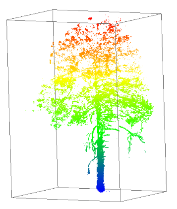
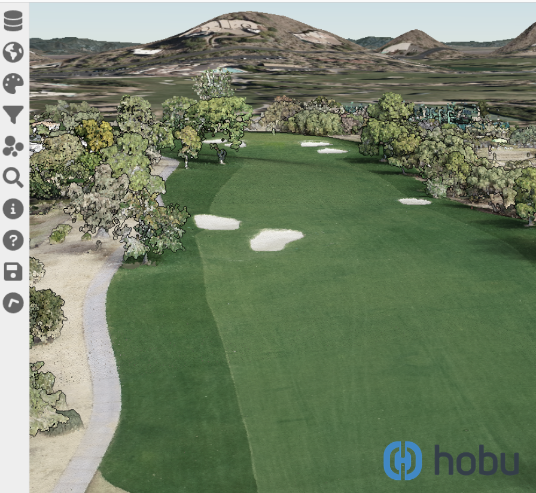

[Jump to :material-hand-clap: hands-on lesson :material-school: ](#hands-on)


## Overview of :material-file-cloud: Cloud Optimized Point Cloud (COPC)

<a href="https://copc.io" style="float:center" target="blank" rel="copc">{ width="200" } </a> 


{ align="right" width="200" height="300" }


The [Cloud Optimized Point Cloud](https://copc.io/){target=_blank} developed by [HOBU](https://hobu.co/){target=_blank} is similar in concept to the [COG](cog.md). It is an `.laz`(lasZip) format with additional point data organized in a clustered [octree](https://en.wikipedia.org/wiki/Octree){target=_blank}. This is similar to how a COG uses overviews and tiles. The octree organization allows for http streaming of point cloud data from cloud storage (AWS S3, Google Cloud Storage, Azure Blob Storage, etc.) to a web browser or other applications. Just like a [COG](cog.md), it eliminates the need to download large datasets to a local machine for visualization and analysis. 


COPC is based on the open source compression file format, `*.LAZ`, which was developed by Martin Isenburg ([RIP](https://lidarmag.com/2021/10/30/in-memoriam-martin-isenburg-1972-2021/){target=_blank}) and is licensed by his company [RapidLASso](https://rapidlasso.de/){target=_blank} 

<a href="https://hobu.co/" target="blank" rel="hobu">{ align="" width="100" } </a>
<a href="https://rapidlasso.de/" target="blank" rel="rapidlasso">{ align="center" width="100" } </a>


For technical information on the formats, see the [COPC Specification](https://copc.io/copc-specification-1.0.pdf){target=_blank} and the [LAS Standard](https://www.asprs.org/a/society/committees/standards/LAS_1_4_r13.pdf){target=_blank}

___


## Example COPCs Online

Here is a drone-based point cloud in the COPC format. It is 686 mb and stored in Cyverse Data Store [here](https://data.cyverse.org/dav-anon/iplant/home/jgillan/USGA/imagery_products/hole17_point_cloud.copc.laz){target=_blank}. You can view it [here](https://viewer.copc.io?state=ee15e0b9ae036865eaada9f398c2d27de94c2cde71bd92cf117156296bf46ab0){target=_blank} using the [COPC Viewer](https://viewer.copc.io/){target=_blank}.


<a href="https://viewer.copc.io?state=ee15e0b9ae036865eaada9f398c2d27de94c2cde71bd92cf117156296bf46ab0" style="float:center" target="blank" rel="copc">{ width="400" } </a> 


[Here](https://viewer.copc.io/?copc=https://data.cyverse.org/dav-anon/iplant/home/tswetnam/agic-2022/USGS_LPC_AZ_VerdeKaibab_B2_TL_2018_LAS_2019.copc.laz){target=_blanck} is another COPC example. It is 3DEP lidar data over Prescott, AZ. It is also stored in the Cyverse Data Store [here](https://data.cyverse.org/dav-anon/iplant/home/tswetnam/agic-2022/USGS_LPC_AZ_VerdeKaibab_B2_TL_2018_LAS_2019.copc.laz){target=_blank}.


___
## Applications that can Read COPC
COPCs are just a special case of `laz`, so any application that can read `laz` can read COPC.

QGIS, CloudCompare, Argis Pro, and PDAL can all read COPC

___

## Entwine Point Tiles
<a href="https://entwine.io" target="blank" rel="entwine">{ width="100" } </a>

[Entwine](https://entwine.io){target=_blank}(EPT) is another cloud-optimized format with similar function to COPC. This format is a few years older than COPC. While COPC is a single compressed file, the EPT consists of many small files (binary and .json) that are organized in a directory structure. 

HoBu was contracted by the USGS to process all of the 3DEP lidar data, these are now hosted on commercial cloud in both reqestor pays buckets and FOR FREE as Entwine Point Tiles: [https://usgs.entwine.io/](https://usgs.entwine.io/)

* More information about these datasets can be found at https://registry.opendata.aws/usgs-lidar/ and at its GitHub page at https://github.com/hobu/usgs-lidar/

* [USGS National Datasets Downloads](https://www.usgs.gov/faqs/can-national-map-data-be-downloaded-direct-links){target=_blank}

____

# Hands On

## Stream COPCs into QGIS

If you are unfamiliar with QGIS, here are 3 ways to use the open-source program

??? Info "Install on your local machine"

    [Download](https://www.qgis.org/en/site/forusers/download.html) and install QGIS on your local machine


??? Info "Use docker to run QGIS locally without installation"

    Educational material on software containers and Docker are [here](https://foss.cyverse.org/07_reproducibility_ii/){target=_blank}.

    ??? Info "Installing Docker on your personal computer"

        We are going to be using virtual machines on the cloud for this course, and we will explain why this is a good thing, but there may be a time when you want to run Docker on your own computer.

        Installing Docker takes a little time but it is reasonably straight forward and it is a one-time setup.

        Installation instructions from Docker Official Docs for common OS and chip architectures:

	      - [:fontawesome-brands-apple: Mac OS X](https://docs.docker.com/docker-for-mac/){target=_blank}
	      - [:fontawesome-brands-windows: Windows](https://docs.docker.com/docker-for-windows){target=_blank}
	      - [:fontawesome-brands-ubuntu: Ubuntu Linux](https://docs.docker.com/install/linux/docker-ce/ubuntu/){target=_blank}

    Once docker has been installed on your local machine it is easiest to use it on the Command Line Interace (CLI). Run the following commands in your terminal:

    this will allow the container access to the X server for display purposes
    
    `xhost +`  

    this will run the QGIS container and open the application

    ```
    docker run --rm -it --name qgis \
        -v $(pwd):/data \
        -v /tmp/.X11-unix:/tmp/.X11-unix \
        -e DISPLAY=unix$DISPLAY \
        qgis/qgis:release-3_34 qgis
    ```    

??? Info "Run cloud instance of QGIS on Cyverse"

    [Cyverse](https://cyverse.org/){target=_blank} is a cloud computing and storage tool housed at the University of Arizona. You can sign up for a user account [here](https://user.cyverse.org/signup){target=_blank}.

    After getting the account, you need to request access to the Visual Interactive Computing Environment (VICE) app. This is a cloud-based desktop environment that allows you to run applications like QGIS in the cloud.
    
    To request VICE access, visit the [User Portal](https://user.cyverse.org/services){target=_blank} look for 
    
    {width=300}
    
    and select the **REQUEST ACCESS** link.

    <br/>

    Instructions for launching QGIS and other interactive apps within Cyverse are found [here](https://learning.cyverse.org/vice/about/#launching-applications){target=_blank}.

Now that you have access to QGIS, let's stream a COPC into the application.

1. Open QGIS

2. In the "Layers" menu, go to "Add Layer" and then "Add Point Cloud Layer" 

3. Choose the Source Type and select "Protocol: HTTP(s), cloud, etc" for a file on your computer
    
4. Enter a valid `https://` in the `URl` field for a COPC you found online
<br/>

    Here are a few examples to try. The first is the golf course point cloud located in the Cyverse Data Store:

    https://data.cyverse.org/dav-anon/iplant/home/jgillan/USGA/imagery_products/hole17_point_cloud.copc.laz

    The next example is 3DEP LiDAR data over Prescott, AZ which is also stored in the Cyverse Data Store:

    https://data.cyverse.org/dav-anon/iplant/home/tswetnam/agic-2022/USGS_LPC_AZ_VerdeKaibab_B2_TL_2018_LAS_2019.copc.laz

5. Click "Add" and the point cloud will stream into QGIS. By default, the point cloud will be displayed in 2D. You can change to a 3D view by going to 'View' menu and selecting '3D map views' and then 'New 3D Map View'

___    
## Create your own COPC

{ width="100" align="right" }

The best toolset to create your own COPC point clouds is [Point Data Abstraction Library (PDAL)](https://pdal.io){target=_blank}, which is a command line tool for translating and manipulating point cloud data.

??? Tip "Installing PDAL"

    **Install to local machine to system PATH:** <br/>
    https://pdal.io/en/2.6.0/download.html#download

    **Install using conda:** <br/>
    `conda create --yes --name pdal --channel conda-forge pdal`

1. Download a small `laz` file from Cyverse Data Store [here](https://data.cyverse.org/dav-anon/iplant/home/jgillan/cog_test/tree.laz
){target=_blank}

2. Go into the directory where you downloaded the file

    On the command line, you would type: <br/>
    `cd ~/Downloads`

3. Execute the PDAL command to convert the `laz` file to `copc.laz`: <br/>
    `pdal translate tree.laz tree.copc.laz`

    You should now have the `copc.laz` file in your directory. The new file should be larger (1.6 m) than the original `laz` file (1.0 m). This is because the `copc.laz` file has additional data that is used to organize the point cloud into an octree.

4. You can upload your file `tree.copc.laz' to Cyverse Data Store for streaming into applications. Please see [this material](cog.md#use-cyverse-to-store-and-share-your-cog) for a tutorial of uploading to Cyverse Data Store. 


[Planetary Computer 3DEP Jupyter Notebook](https://github.com/microsoft/PlanetaryComputerExamples/blob/main/datasets/3dep-lidar/3dep-lidar-copc-example.ipynb){target=_blank}


