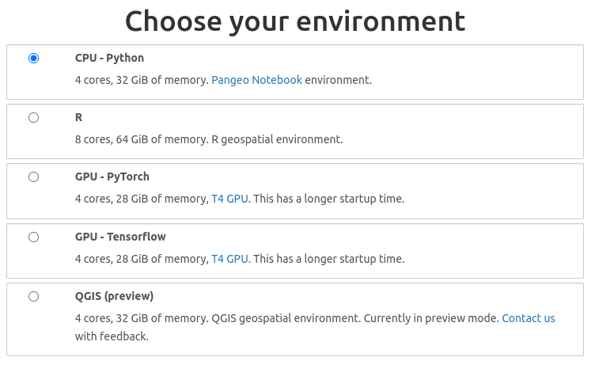

## Google Earth Engine

## Microsoft Planetary Computer
<a href="https://planetarycomputer.microsoft.com/" align="left" target="blank" rel="MPC">{ width="300" } </a>

<figure markdown>
  { width="500" }
  <figcaption> </figcaption>
</figure>
You can interact with it using Python or R in a Jupyter Notebook environment

You can open a QGIS instance on MPC, and load data using the STAC plugin. 

Pangeo software

## Integrated Development Environments (IDE) 

IDEs are graphic user interfaces (GUI) for working with code and data.

Modern IDEs are designed to interact with cloud and cloud native data types with few additional extensions.

The most popular software development IDE for working with code is Microsoft's Visual Studio Code (:material-microsoft-visual-studio-code: VS Code). VS Code has extensions for many geospatial applications and can be used to run large compute clusters on cloud.

<a href="https://code.visualstudio.com/" align="left" target="blank" rel="vscode">{ width="100" }</a>

[RStudio](https://rstudio.com){target=_blank} and [Project Jupyter](https://jupyter.org/){target=_blank} are two other widely used IDE for working with code and data for research. RStudio focuses mostly on the [:material-language-r: R programming language](https://www.r-project.org/){target=_blank}, but has backward compatibility with Python. 

<a href="https://rstudio.com/" align="left" target="blank" rel="rstudio">{ width="200" }</a>

Project Jupyter is focused on [:material-language-python: Python](https://www.python.org/){target=_blank} but has broad compatibility (kernels) across [almost every programming language](https://github.com/jupyter/jupyter/wiki/Jupyter-kernels){target=_blank}. Project Jupyter was adopted as the default IDE by several cloud platforms for [on-demand virtual machines](#on-demand-cloud-based-ide).

[:material-language-python: Geospatial Ecosystem](https://ecosystem.pythongis.org/){target=_blank}

<a href="https://jupyter.org/" align="left" target="blank" rel="jupyter">{ width="100" }</a>

[:fontawesome-solid-q: QGIS](https://qgis.org){target=_blank} is the most popular IDE for open source GIS applications and has native features which allow users to load cloud optimized and analysis ready data.

<a href="https://qgis.org" align="left" target="blank" rel="qgis">{ width="200" }</a>

## Cloud Workbenches

[CyVerse Discovery Environment](https://de.cyverse.org/){target=_blank} - multi-platform service for full-stack cloud data management 

[DesignSafe CI](https://www.designsafe-ci.org/){target=_blank} - workbench for natural hazards research.
   
[HydroShare](https://www.hydroshare.org/){target=_blank} - platform for hydrological science applications supported by CUAHSI 

[OSF.io](https://osf.io/){target=_blank} - is a free, open source web application that connects and supports the research workflow, enabling scientists to increase the efficiency and effectiveness of their research.

[RStudio Workbench](https://www.rstudio.com/products/workbench/){target=_blank} -  is an integrated development environment for R, a programming language for statistical computing and graphics. It is available in two formats: RStudio Desktop is a regular desktop application while RStudio Server runs on a remote server and allows accessing RStudio using a web browser.

## On-Demand Cloud-based IDE

Free services running virtual machines on the cloud allow you to start and work in your browser. These include Google's Collaboratory (CoLab), the MyBinder Project, GitHub's CodeSpaces, and GitPod. 

[CoLab](https://colab.research.google.com/){target=_blank} - Google's CoLaboratory starts a Jupyter Notebook, limited in size but can be increased with subscription.                

[CodeSpaces](https://github.com/features/codespaces){target=_blank} - GitHub's CodeSpaces starts a VS Code instance from a GitHub Repository which can be variabily sized (requires subscription)      

[GitPod](https://www.gitpod.io/){target=_blank} - starts a VS Code instance that can be variably sized 

[MyBinder.org](https://mybinder.org/){target=_blank} - starts a defined environment (RStudio, Jupyter, VS Code) from a GitHub Repository, limited in size.                       
     

