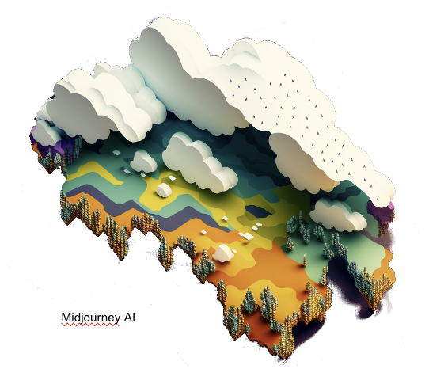
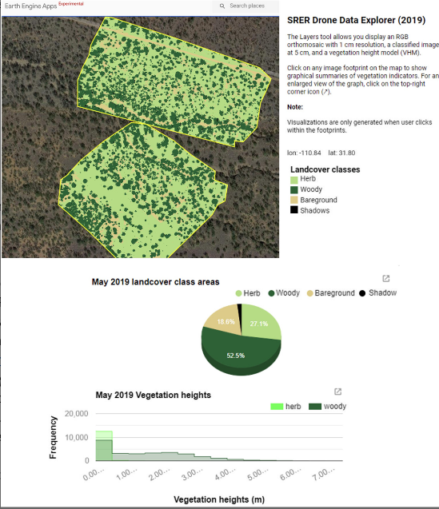

{ width="300" }

As mentioned in the [introduction](index.md#cloud-compute), cloud computing is all about moving geospatial analysis and computation from your local machine to a remote machine in the cloud. This approach has several advantages over traditional desktop computing.

!!! Success "Advantages of Cloud Computing"
        
        * With cloud computing, you can avoid the upfront cost and complexity of owning and maintaining your own IT infrastructure
        * Cloud computing allows groups or individuals to scale up (or down) their operations quickly as their computing needs change
        * Cloud computing allows users to access their data and applications from anywhere, on any device, at any time
        * Geospatial in the cloud empowers colleagues to work directly together on the same data, models, and applications. The same way that [Google Docs](https://www.google.com/docs/about/){target=_blank} allows multiple people to work on the same document at the same time

___

### Google Earth Engine

<a href="https://earthengine.google.com/ style="float:left" target="blank" rel="app">{ width="100" } </a>


* 70 pb and 800+ curated [geospatial datasets](https://developers.google.com/earth-engine/datasets){target=_blank}, including 40 years of satellite imagery 

* 250 GB of free storage for your own data

* Javascript code editor to execute commands

* Use GEE python [library](https://developers.google.com/earth-engine/guides/python_install){target=_blank} to interact with GEE from your IDE

* You can create GEE 'apps' which are basically mini web sites to interact with data. Check out this [example app showcasing drone imagery](https://bit.ly/srer-drone-2019){target=_blank}.

<a href="https://bit.ly/srer-drone-2019" style="float:center" target="blank" rel="app">{ width="500" } </a>


This [video](https://www.youtube.com/watch?v=HofrUehuEk4){target=_blank} gives a gentle introduction to GEE and is aimed at non-coders

* [Earth Blox](https://www.earthblox.io/){target=_blank} is a non-coding interface for using GEE. This is commercial software, but reduced price for academic use.

* You [import](https://developers.google.com/earth-engine/guides/image_overview){target=_blank} and and [export](https://developers.google.com/earth-engine/guides/exporting_images){target=_blank} Cloud Optimized Geotiffs in GEE

</br>
___

### Microsoft Planetary Computer
<a href="https://planetarycomputer.microsoft.com/" align="right" target="blank" rel="MPC">{ width="300" } </a>

<figure markdown>
  { width="500" }
  <figcaption> </figcaption>
</figure>
* Using the Planetary Computer HUB, You can interact with it using Python or R in a Jupyter Notebook environment

* When launching a Jupyter Notebook, the environment uses a Pangeo Notebook, which means it is preloaded with a lot [geospatial python libraries](https://github.com/pangeo-data/pangeo-docker-images/blob/master/pangeo-notebook/packages.txt){target=_blank}. 

```
import pystac_client
import planetary_computer

catalog = pystac_client.Client.open(
    "https://planetarycomputer.microsoft.com/api/stac/v1/",
    modifier=planetary_computer.sign_inplace,
)
point = {"type": "Point", "coordinates": [-112.107676, 36.101690]}
search = catalog.search(collections=["nasadem"], intersects=point, limit=1)
item = next(search.get_items())
item
```


* [Planetary Computer Data Catalog](https://planetarycomputer.microsoft.com/catalog){target=_blank} 

* You can open a QGIS instance on MPC, and load data using the STAC plugin. 

* You can connect to Planetary Computer using a local instance of VS Code

* All of the datasets are indexed using the SpatioTemporal Asset Catalog (STAC) standard API

* You can now access Planetary Computer Data Catalog from [ArcGIS Pro](https://www.esri.com/en-us/c/product/arcgis-for-microsoft-planetary-computer){target=_blank}

___
### Integrated Development Environments (IDE) 

IDEs are graphic user interfaces (GUI) for working with code and data.

Modern IDEs are designed to interact with cloud and cloud native data types with few additional extensions.

The most popular software development IDE for working with code is Microsoft's Visual Studio Code (:material-microsoft-visual-studio-code: VS Code). VS Code has extensions for many geospatial applications and can be used to run large compute clusters on cloud.

<a href="https://code.visualstudio.com/" align="left" target="blank" rel="vscode">{ width="100" }</a>

[RStudio](https://rstudio.com){target=_blank} and [Project Jupyter](https://jupyter.org/){target=_blank} are two other widely used IDE for working with code and data for research. RStudio focuses mostly on the [:material-language-r: R programming language](https://www.r-project.org/){target=_blank}, but has backward compatibility with Python. 

<a href="https://rstudio.com/" align="left" target="blank" rel="rstudio">{ width="200" }</a>

Project Jupyter is focused on [:material-language-python: Python](https://www.python.org/){target=_blank} but has broad compatibility (kernels) across [almost every programming language](https://github.com/jupyter/jupyter/wiki/Jupyter-kernels){target=_blank}. Project Jupyter was adopted as the default IDE by several cloud platforms for [on-demand virtual machines](#on-demand-cloud-based-ide).

[:material-language-python: Geospatial Ecosystem](https://ecosystem.pythongis.org/){target=_blank}

<a href="https://jupyter.org/" align="left" target="blank" rel="jupyter">{ width="100" }</a>

[:fontawesome-solid-q: QGIS](https://qgis.org){target=_blank} is the most popular IDE for open source GIS applications and has native features which allow users to load cloud optimized and analysis ready data.

<a href="https://qgis.org" align="left" target="blank" rel="qgis">{ width="200" }</a>


## Cloud Workbenches

[CyVerse Discovery Environment](https://de.cyverse.org/){target=_blank} - multi-platform service for full-stack cloud data management 

[DesignSafe CI](https://www.designsafe-ci.org/){target=_blank} - workbench for natural hazards research.
   
[HydroShare](https://www.hydroshare.org/){target=_blank} - platform for hydrological science applications supported by CUAHSI 

[OSF.io](https://osf.io/){target=_blank} - is a free, open source web application that connects and supports the research workflow, enabling scientists to increase the efficiency and effectiveness of their research.

[RStudio Workbench](https://www.rstudio.com/products/workbench/){target=_blank} -  is an integrated development environment for R, a programming language for statistical computing and graphics. It is available in two formats: RStudio Desktop is a regular desktop application while RStudio Server runs on a remote server and allows accessing RStudio using a web browser.

## On-Demand Cloud-based IDE

Free services running virtual machines on the cloud allow you to start and work in your browser. These include Google's Collaboratory (CoLab), the MyBinder Project, GitHub's CodeSpaces, and GitPod. 

[CoLab](https://colab.research.google.com/){target=_blank} - Google's CoLaboratory starts a Jupyter Notebook, limited in size but can be increased with subscription.                

[CodeSpaces](https://github.com/features/codespaces){target=_blank} - GitHub's CodeSpaces starts a VS Code instance from a GitHub Repository which can be variabily sized (requires subscription)      

[GitPod](https://www.gitpod.io/){target=_blank} - starts a VS Code instance that can be variably sized 

[MyBinder.org](https://mybinder.org/){target=_blank} - starts a defined environment (RStudio, Jupyter, VS Code) from a GitHub Repository, limited in size.                       
     


