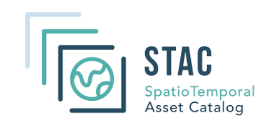
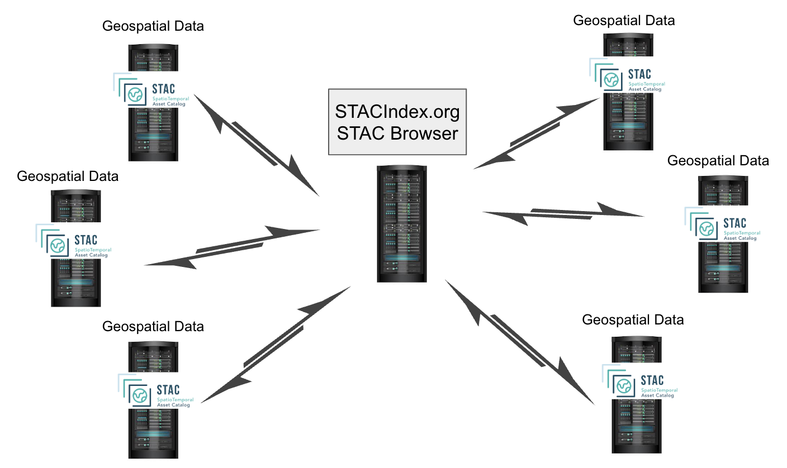
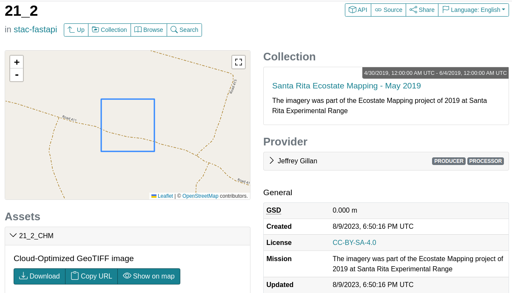
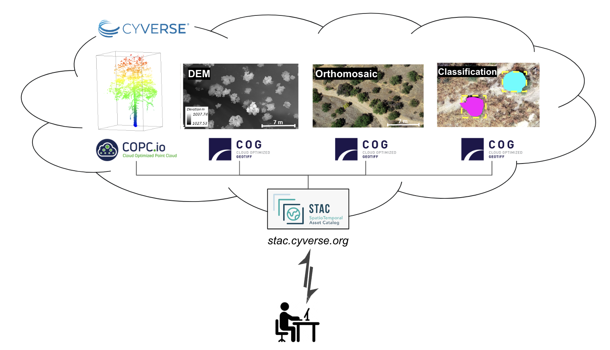

## Introduction to STAC <a href= style="float:right" target="blank" rel="geojson">{ width="200" height="200" } </a>

[SpatioTemporal Asset Catalogs (STAC)](https://stacspec.org/en){target=_blank} are json and geojson files that describe (i.e., metadata) and catalog geospatial assets for ease of discovery and sharing across the web. The geospatial assets can be any type of geospatial data, including imagery, point clouds, datacubes, and vector data. Developing STAC has been an open collaborative effort across the geospatial community with the goal of standardizing the way geospatial assets are described and shared across the web. 

Using the STAC model, geospatial assets can be stored anywhere in cloud storage (like s3, blob, google cloud, or Cyverse). The json and geojson files that are used to describe and locate the assets can also be located anywhere, but are all indexed in a central place, the [STAC Index](https://stacindex.org/). ***By using this model we are essentially creating one giant open catalog of geospatial data.*** 


<figure markdown>
  { width="450" }
  <figcaption>The STAC distributed catalog model </figcaption>
</figure>

Browsing through STAC catalogs to find data or imagery of interest can be done basically two ways:

* The [Radiant Earth STAC Browser](https://radiantearth.github.io/stac-browser/#/){target=_blank} provides a nice graphical interface to browse through content and a map to preview the data. There will typically be descriptions of the data including the data provider, the data license, and the data format. There will also be links to download or stream the actual data from it's location in cloud storage.


<figure markdown>
  { width="500" }
  <figcaption>Browsing Geospatial Data with STAC Browser </figcaption>
</figure>

* You can query and interact with STAC catalogs programmatically by using python libraries such as [pystac](https://pystac.readthedocs.io/en/latest/index.html){target=_blank} and [pystac_client](https://pystac-client.readthedocs.io/en/stable/index.html){target=_blank}. 

Use Case 1: A researcher wants to find all the Sentinel-2 imagery that is available for a particular area of interest. They can search the [STAC Index](https://stacindex.org/) for all the STACs that contain Sentinel-2 imagery. They can then search the STACs for the imagery that they need.

<figure markdown>
  { width="500" }
  <figcaption> </figcaption>
</figure>


[STAC Spec on GitHub](https://github.com/radiantearth/stac-spec){target=_blank}

The [Radiant Earth STAC Browser](https://radiantearth.github.io/stac-browser/#/){target=_blank} allows users to search, preview, and access these massive geospatial assets hosted over conventional `https://` endpoints and cloud-base object stores (i.e., `s3://` buckets).

[STAC Index](https://stacindex.org/)

There are four components to making a given STAC run. They can be used independently of one another, but most often they are all used together:

| Component | Definition | Format |
|-----------|------------|--------|
| `item` | core atomic unit, representing a single spatiotemporal `asset` | `GeoJSON` |
| `catalogs` | a file of links that provides a structure to organize and browse STAC Items | `JSON` |
| `collections` | additional information such as the extents, license, keywords, providers, etc that describe STAC Items | `JSON` |
| `API` | a RESTful endpoint that enables search of STAC Items, specified in [OpenAPI](https://spec.openapis.org/oas/v3.1.0){target=_blank}, following [OGC Web Feature Service 3.0](https://svn.osgeo.org/gdal/trunk/gdal/ogr/ogrsf_frmts/wfs/drv_wfs3.html){target=_blank} | Web Service |


``` mermaid
classDiagram
  Catalog <|--|> Collection
  Catalog <|--|> Item
  Child_Catalog <|--|> Child_Collection
  Catalog <|--|> Child_Catalog
  Child_Catalog <|--|> Child_Item
  Child_Item <|--|> GeoJSON
  Child_Item <|--|> Info
  class Catalog{
    self absolute URL
    root URL 
    parent URL
    child URL
  }
  class Item{
    self
    root
    parent
    child
    item
  }
  class Child_Item{
    self
    root
    parent
    child
    item
  }
  class Catalog{
    self
    root
    parent
    child
  }
  class Collection{
    self
    root
    parent
    child
  }
  class GeoJSON{
    id
    type
    bbox
    properties
  }
  class Info{
    stac version
    stac extensions
    links
    assets
  }
```

### `asset`

The `assets` are the actual datasets presented through the STAC. 

The `assets` are typically stored in cloud optimized formats like [GeoTIFF (COG)](./cog.md) (`.tif`), [point cloud (COPC)](./copc.md) (`.laz`), or [datacubes](./zarr.md) like HDF5, NetCDF, Xarray, or Zarr (`.hdf`, `.nc`, `.DataArray`, `.zarr`).

within the `assets` block,  the `"href": "https://storage.googleapis.com/open-cogs/stac-examples/20201211_223832_CS2.tif"` points directly to the physical file on the internet.

When the asset file is in a cloud optimized format, it can be read dynamically without downloading the entire file.

??? Info ":material-code-json: Example `assets` block in an `item`"

    ``` json
    "assets": {
        "visual": {
            "href": "https://storage.googleapis.com/open-cogs/stac-examples/20201211_223832_CS2.tif",
            "type": "image/tiff; application=geotiff; profile=cloud-optimized",
            "title": "3-Band Visual",
            "roles": [
                "visual"
            ]
        },
        "thumbnail": {
            "href": "https://storage.googleapis.com/open-cogs/stac-examples/20201211_223832_CS2.jpg",
            "title": "Thumbnail",
            "type": "image/jpeg",
            "roles": [
                "thumbnail"
            ]
        }
    }
    ```

### `items` 

An `item` is described by [GeoJSON](https://cogeo.org) with metadata which describe an `asset` and links to the actual data hosted on the internet. 

[`item` specification](https://github.com/radiantearth/stac-spec/blob/master/item-spec/item-spec.md){target=_blank}

`items` enable the client (a STAC Browser) to scan a `catalog` and present the metadata and to preview the `asset`.

??? Info ":material-code-json: Example `item`"

    [Example simple-item.json](https://raw.githubusercontent.com/radiantearth/stac-spec/master/examples/simple-item.json){target=_blank}

    ``` json
    {
        "stac_version": "1.0.0",
        "stac_extensions": [],
        "type": "Feature",
        "id": "20201211_223832_CS2",
        "bbox": [
            172.91173669923782,
            1.3438851951615003,
            172.95469614953714,
            1.3690476620161975
            ],
        "geometry": {
            "type": "Polygon",
            "coordinates": [
                [
                    [
                        172.91173669923782,
                        1.3438851951615003
                    ],
                    [
                        172.95469614953714,
                        1.3438851951615003
                    ],
                    [
                        172.95469614953714,
                        1.3690476620161975
                    ],
                    [
                        172.91173669923782,
                        1.3690476620161975
                    ],
                    [
                        172.91173669923782,
                        1.3438851951615003
                    ]
                ]
            ]
        },
        "properties": {
        "datetime": "2020-12-11T22:38:32.125000Z"
        },
        "collection": "simple-collection",
        "links": [
            {
                "rel": "collection",
                "href": "./collection.json",
                "type": "application/json",
                "title": "Simple Example Collection"
            },
            {   
                "rel": "root",
                "href": "./collection.json",
                "type": "application/json",
                "title": "Simple Example Collection"
            },
            {
                "rel": "parent",
                "href": "./collection.json",
                "type": "application/json",
                "title": "Simple Example Collection"
            }
        ],
        "assets": {
            "visual": {
                "href": "https://storage.googleapis.com/open-cogs/stac-examples/20201211_223832_CS2.tif",
                "type": "image/tiff; application=geotiff; profile=cloud-optimized",
                "title": "3-Band Visual",
                "roles": [
                    "visual"
                ]
            },
            "thumbnail": {
                "href": "https://storage.googleapis.com/open-cogs/stac-examples/20201211_223832_CS2.jpg",
                "title": "Thumbnail",
                "type": "image/jpeg",
                "roles": [
                    "thumbnail"
                ]
            }
        }
    }
    ```

### `catalogs` 

A `catalog` is a simple, flexible JSON file with links that provides the structure to organize and browse STAC `items`. 

[`catalog` specification](https://github.com/radiantearth/stac-spec/blob/master/catalog-spec/catalog-spec.md){target=_blank}


**STAC Catalog Relation and Media Types**

`Self`: Absolute URL to the JSON file

`Root`: URL to root `catalog` or `collection`

`Parent`: URL to a Parent STAC Specification (could be an `item`, `catalog`, or `collection`)

`Child`: URL to a Child STAC Specification (`item`, `catalog`, or `collection`)

??? Info ":material-code-json: Catalog Relation and Media Type examples"

    ``` json
    {
    "id": "examples",
    "type": "Catalog",
    "title": "Example Catalog",
    "stac_version": "1.0.0",
    "description": "This catalog is a simple demonstration of an example catalog that is used to organize a hierarchy of collections and their items.",
    "links": [
        {
        "rel": "root",
        "href": "./catalog.json",
        "type": "application/json"
        },
        {
        "rel": "child",
        "href": "./extensions-collection/collection.json",
        "type": "application/json",
        "title": "Collection Demonstrating STAC Extensions"
        },
        {
        "rel": "child",
        "href": "./collection-only/collection.json",
        "type": "application/json",
        "title": "Collection with no items (standalone)"
        },
        {
        "rel": "child",
        "href": "./collection-only/collection-with-schemas.json",
        "type": "application/json",
        "title": "Collection with no items (standalone with JSON Schemas)"
        },
        {
        "rel": "item",
        "href": "./collectionless-item.json",
        "type": "application/json",
        "title": "Collection with no items (standalone)"
        },
        {
        "rel": "self",
        "href": "https://raw.githubusercontent.com/radiantearth/stac-spec/v1.0.0/examples/catalog.json",
        "type": "application/json"
        }
    ]
    }
    ```

??? Info ":material-code-json: Example `catalog`"

    [Example of a `catalog](https://raw.githubusercontent.com/radiantearth/stac-spec/master/examples/catalog.json){target=_blank}

    ``` json
    {
    "id": "examples",
    "type": "Catalog",
    "title": "Example Catalog",
    "stac_version": "1.0.0",
    "description": "This catalog is a simple demonstration of an example catalog that is used to organize a hierarchy of collections and their items.",
    "links": [
        {
        "rel": "root",
        "href": "./catalog.json",
        "type": "application/json"
        },
        {
        "rel": "child",
        "href": "./extensions-collection/collection.json",
        "type": "application/json",
        "title": "Collection Demonstrating STAC Extensions"
        },
        {
        "rel": "child",
        "href": "./collection-only/collection.json",
        "type": "application/json",
        "title": "Collection with no items (standalone)"
        },
        {
        "rel": "child",
        "href": "./collection-only/collection-with-schemas.json",
        "type": "application/json",
        "title": "Collection with no items (standalone with JSON Schemas)"
        },
        {
        "rel": "item",
        "href": "./collectionless-item.json",
        "type": "application/json",
        "title": "Collection with no items (standalone)"
        },
        {
        "rel": "self",
        "href": "https://raw.githubusercontent.com/radiantearth/stac-spec/v1.0.0/examples/catalog.json",
        "type": "application/json"
        }
    ]
    }
    ```

### `collections`

`collections` include important annotation metadata about multiple `catalogs` and `items`.

[`collection` specification](https://github.com/radiantearth/stac-spec/blob/master/collection-spec/collection-spec.md){target=_blank}

A simple `collection` contains a minimum of three `JSON` items:

| Component | Definition | Format |
|-----------|------------|--------|
| `simple-item` | | `JSON` |
| `core-item` | | `JSON` |
| `extended-item` | | `JSON` |

??? Info ":material-code-json: Example `collection` items"

    In addition to the three linked items, the `root` and `self` provide links to themselves:

    ``` json
    "links": [
        {
        "rel": "root",
        "href": "./collection.json",
        "type": "application/json",
        "title": "Simple Example Collection"
        },
        {
        "rel": "item",
        "href": "./simple-item.json",
        "type": "application/geo+json",
        "title": "Simple Item"
        },
        {
        "rel": "item",
        "href": "./core-item.json",
        "type": "application/geo+json",
        "title": "Core Item"
        },
        {
        "rel": "item",
        "href": "./extended-item.json",
        "type": "application/geo+json",
        "title": "Extended Item"
        },
        {
        "rel": "self",
        "href": "https://raw.githubusercontent.com/radiantearth/stac-spec/v1.0.0/examples/collection.json",
        "type": "application/json"
        }
    ```    

??? Info ":material-code-json: Example `collection`"

    [Example of a simple-collection.json](https://raw.githubusercontent.com/radiantearth/stac-spec/master/examples/collection.json){target=_blank}

    ``` json
    {
    "id": "simple-collection",
    "type": "Collection",
    "stac_extensions": [
        "https://stac-extensions.github.io/eo/v1.0.0/schema.json",
        "https://stac-extensions.github.io/projection/v1.0.0/schema.json",
        "https://stac-extensions.github.io/view/v1.0.0/schema.json"
    ],
    "stac_version": "1.0.0",
    "description": "A simple collection demonstrating core catalog fields with links to a couple of items",
    "title": "Simple Example Collection",
    "providers": [
        {
        "name": "Remote Data, Inc",
        "description": "Producers of awesome spatiotemporal assets",
        "roles": [
            "producer",
            "processor"
        ],
        "url": "http://remotedata.io"
        }
    ],
    "extent": {
        "spatial": {
        "bbox": [
            [
            172.91173669923782,
            1.3438851951615003,
            172.95469614953714,
            1.3690476620161975
            ]
        ]
        },
        "temporal": {
        "interval": [
            [
            "2020-12-11T22:38:32.125Z",
            "2020-12-14T18:02:31.437Z"
            ]
        ]
        }
    },
    "license": "CC-BY-4.0",
    "summaries": {
        "platform": [
        "cool_sat1",
        "cool_sat2"
        ],
        "constellation": [
        "ion"
        ],
        "instruments": [
        "cool_sensor_v1",
        "cool_sensor_v2"
        ],
        "gsd": {
        "minimum": 0.512,
        "maximum": 0.66
        },
        "eo:cloud_cover": {
        "minimum": 1.2,
        "maximum": 1.2
        },
        "proj:epsg": {
        "minimum": 32659,
        "maximum": 32659
        },
        "view:sun_elevation": {
        "minimum": 54.9,
        "maximum": 54.9
        },
        "view:off_nadir": {
        "minimum": 3.8,
        "maximum": 3.8
        },
        "view:sun_azimuth": {
        "minimum": 135.7,
        "maximum": 135.7
        }
    },
    "links": [
        {
        "rel": "root",
        "href": "./collection.json",
        "type": "application/json",
        "title": "Simple Example Collection"
        },
        {
        "rel": "item",
        "href": "./simple-item.json",
        "type": "application/geo+json",
        "title": "Simple Item"
        },
        {
        "rel": "item",
        "href": "./core-item.json",
        "type": "application/geo+json",
        "title": "Core Item"
        },
        {
        "rel": "item",
        "href": "./extended-item.json",
        "type": "application/geo+json",
        "title": "Extended Item"
        },
        {
        "rel": "self",
        "href": "https://raw.githubusercontent.com/radiantearth/stac-spec/v1.0.0/examples/collection.json",
        "type": "application/json"
        }
    ]
    }
    ```

### API 

The STAC API 

[`API` specification](){target=_blank}

## Creating your own STACs

Generating your own STACs can be done manually, programmatically, or using a templated editor. 

[Create a Catalog with PyStac](https://pystac.readthedocs.io/en/latest/index.html){target=_blank}, a python library

[Tutorials to read/write STAC ](https://stacspec.org/en/tutorials/intro-to-stac/){target=_blank} using the python library [Pystac](https://pystac.readthedocs.io/en/latest/index.html){target=_blank}

[Official STAC Learning Examples](https://stacindex.org/learn){target=_blank}


* [Microsoft Planetary Computer STACs](https://planetarycomputer.microsoft.com/catalog){target=_blank}

* [Microsoft Planetary Computer Jupyter Notebook Examples](https://github.com/microsoft/PlanetaryComputerExamples){target=_blank}


* [QGIS STAC Browser Plugin](https://stacspec.org/en/tutorials/1-install-stac-api-browser-qgis-plugin/){target=_blank}

* [Scene Explorer ESRI](https://www.esri.com/en-us/arcgis-marketplace/listing/products/b1689f3ddcf742de988e0d5a070b31c4){target=_blank}


